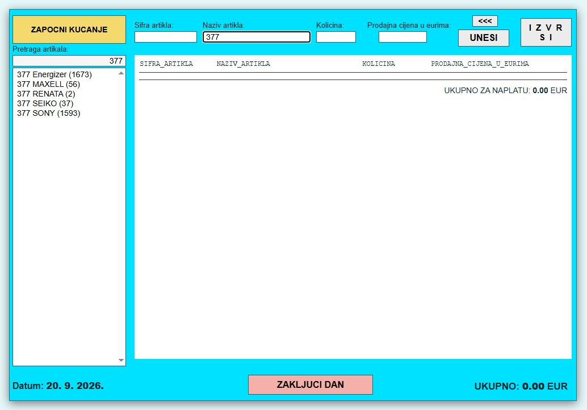

# CASIO Sales

Web aplikacija za prodaju artikala i vođenje dnevnog prometa, razvijena u Java/Spring Boot okruženju.

Aplikacija koristi **Spring Boot, Thymeleaf, SQLite i Spring JDBC**, uz jednostavan i funkcionalan web interfejs namenjen brzom radu na prodajnom mestu.

## Izgled aplikacije



## Tehnologije

* Java 17
* Spring Boot 3.3.5
* Maven
* Thymeleaf
* HTML / CSS / JavaScript
* SQLite
* Spring JDBC

## Trenutno implementirano

* početni ekran prodaje
* `ZAPOČNI KUCANJE`
* pretraga artikala po šifri
* pretraga artikala po nazivu
* izbor pronađenog artikla
* unos količine
* ručni unos prodajne cene
* `UNESI`
* prikaz stavki računa
* uklanjanje poslednje stavke
* `IZVRŠI`
* smanjenje količine artikla na stanju
* obračun nabavne vrednosti
* obračun prodajne vrednosti
* obračun razlike / zarade
* vođenje dnevnog prometa
* `ZAKLJUČI DAN`
* unos uplate dnevnog pazara
* prikaz preostalog novca u kasi
* sprečavanje daljeg unosa prodaje nakon zaključivanja dana
* validacija količine i prodajne cene
* zaštita od prodaje veće količine od raspoložive zalihe
* transakcijska obrada promena baze

## Baza podataka

Aplikacija koristi SQLite bazu za čuvanje artikala, zaliha i podataka o dnevnom prometu.

U repozitorijumu je uključena **sanitizovana demo kopija baze** namenjena pokretanju i demonstraciji aplikacije.

Istorijski promet i mesečni troškovi uklonjeni su iz demo baze radi zaštite podataka.

## Struktura projekta

```text
spring-boot-app/
├── pom.xml
├── src/
│   ├── main/
│   │   ├── java/
│   │   │   └── rs/casio/sales/
│   │   │       ├── controller/
│   │   │       ├── model/
│   │   │       ├── repository/
│   │   │       └── service/
│   │   └── resources/
│   │       ├── data/
│   │       │   └── baza_proizvoda.db
│   │       ├── static/
│   │       └── templates/
│   └── test/
│       └── java/
├── .gitignore
└── README.md
```

## Pokretanje

Potrebni su Java 17 i Maven.

Pokretanje preko Maven-a:

```text
mvn spring-boot:run
```

Nakon pokretanja aplikacija je dostupna na:

```text
http://localhost:8080/
```

Aplikacija se može pokrenuti i kao izgrađeni Spring Boot JAR.

## Testovi

Projekat sadrži integracione testove za ključne poslovne funkcionalnosti, uključujući:

* pretragu i izbor artikala
* obračun prodaje
* smanjenje zalihe
* ažuriranje dnevnog prometa
* zaključivanje dana
* sprečavanje prodaje nakon zaključivanja dana

## GitHub

Repozitorijum je javno dostupan:

**github.com/ZoranZoxxx/casio-sales**

Demo baza je uključena u repozitorijum, dok su runtime podaci, build fajlovi i lokalni razvojni fajlovi isključeni preko `.gitignore`.

## Status

Projekat je funkcionalna Spring Boot web aplikacija sa implementiranim osnovnim tokom prodaje, upravljanjem zalihama i dnevnim prometom.
